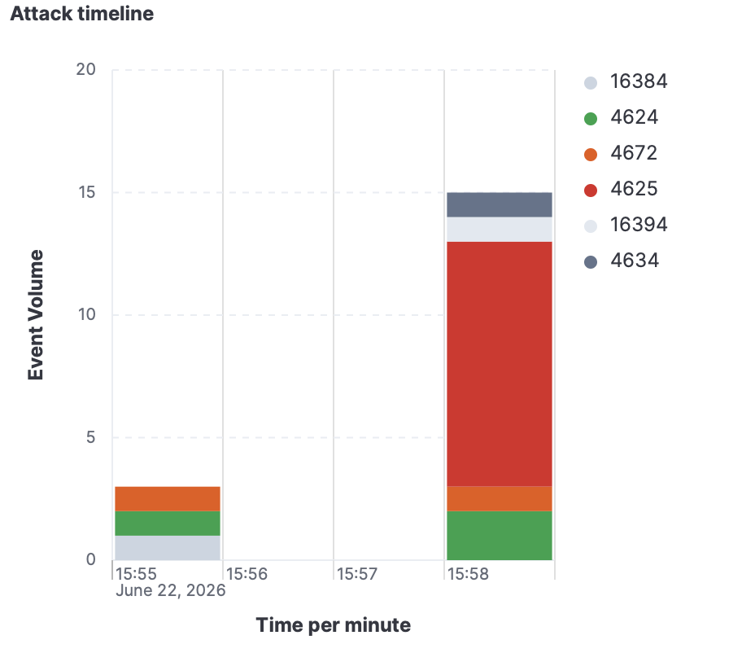
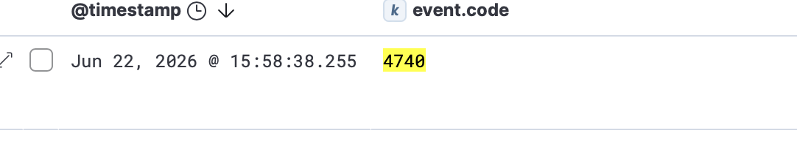
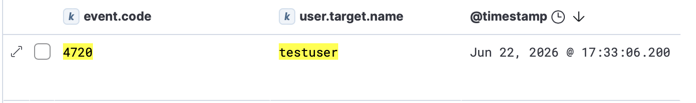
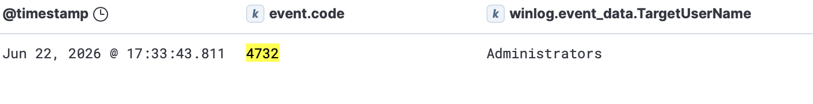
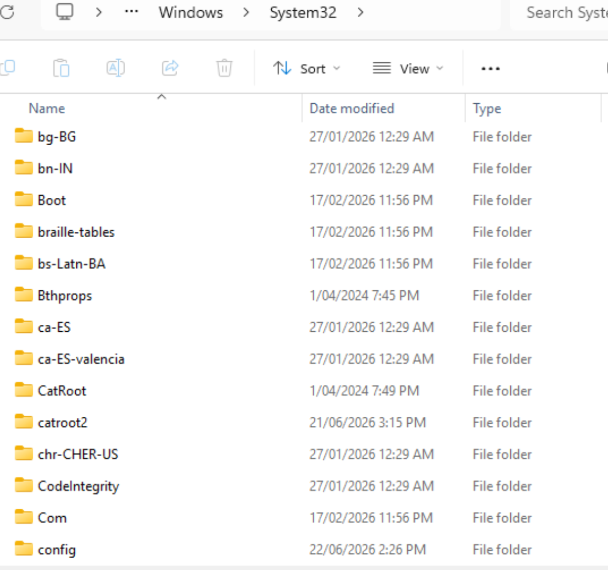
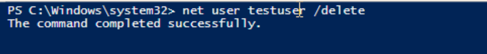

# SIEM Home Lab — Threat Detection with Elastic Stack

## Overview
A hands-on home lab simulating real-world cyber attacks and detecting 
them using Elastic Stack (ELK). Built to develop practical SOC analyst 
skills in log analysis, alert triage, and incident response.

## Lab Architecture
| Component | Role | Tool |
|-----------|------|------|
| Ubuntu 24.04 VM | SIEM Server | Elasticsearch + Kibana 8.13 (Docker) |
| Windows 11 VM | Victim machine | Winlogbeat 8.13 |
| Kali Linux VM | Attack machine | crackmapexec, nmap |

All traffic isolated on VMware Fusion Host-only network (172.16.10.0/24).

---

## Use Case 1: SMB Reconnaissance
**MITRE ATT&CK:** T1046 — Network Service Discovery

### What I Simulated
Used crackmapexec from Kali Linux to perform SMB reconnaissance 
against the Windows 11 VM, identifying the OS version and SMB 
configuration without credentials.

### Finding

crackmapexec successfully identified:
- Target OS: Windows 11 / Server 2025 Build 26100
- SMBv1: Disabled (not vulnerable to EternalBlue/WannaCry)
- SMB Signing: Enabled (prevents relay attacks)

### Why This Matters
Reconnaissance is the first phase of the attack kill chain. 
Knowing the exact OS version allows attackers to look up 
specific CVEs. The fact that SMBv1 is disabled and signing 
is enabled tells the attacker which attack vectors are unavailable.

### Detection Limitation
Port scan reconnaissance does not appear in Windows Event Log 
by default. Detecting network-level reconnaissance requires 
additional tools such as Suricata or Zeek for network traffic 
analysis — beyond the scope of this lab's current architecture.

### As a SOC Analyst I Would
1. Implement network-level monitoring (Suricata/Zeek) to detect 
   reconnaissance activity
2. Review firewall logs for unusual scanning patterns
3. Correlate with subsequent brute force attempts from same source IP

---

## Use Case 2: Brute Force Attack
**MITRE ATT&CK:** T1110 — Brute Force

### What I Simulated
Used crackmapexec with rockyou.txt wordlist to perform a dictionary 
attack against the Windows 11 Administrator account via SMB (port 445).

### Attack Evidence

### Kibana Detection

Event ID 4625 (Logon Failure) spiked from 0 to 13+ events per minute 
during the attack window (15:58 Jun 22, 2026).

Event ID 4740 triggered at 15:58:38 — Windows automatically locked 
the Administrator account after repeated failures.

### Why This Matters
A single 4625 event is normal (user mistyped password). 
13 events in one minute from the same source IP is a clear 
indicator of automated credential stuffing. The 4740 lockout 
confirms the attack triggered Windows' built-in account 
lockout policy.

### As a SOC Analyst I Would
1. Check if any 4624 (successful login) occurred after the 
   4625 spike — if yes, escalate immediately
2. Block the source IP (172.16.10.130) at the firewall
3. Notify the account owner and verify no unauthorized access
4. Review logs for any lateral movement after the attack window

---

## Use Case 3: Suspicious Account Creation & Privilege Escalation
**MITRE ATT&CK:** T1136.001 (Create Local Account) + T1078 (Valid Accounts)

### What I Simulated
Manually simulated post-compromise behaviour: creating a backdoor 
account, escalating privileges, accessing sensitive system directories, 
and deleting the account to cover tracks.

### Attack Sequence

**Step 1 — Account Created (4720)**

testuser account created at 17:33:06.

**Step 2 — Added to Administrators Group (4732)**

testuser added to Administrators group at 17:33:43 — 
37 seconds after creation. Normal IT operations don't 
create accounts and immediately grant admin rights.

**Step 3 — Accessed System32 with Admin Privileges**

Confirmed testuser has full access to C:\Windows\System32, 
verifying administrator-level privileges.

**Step 4 — Account Deleted to Cover Tracks**

testuser deleted. However, the SIEM has already recorded 
the complete attack chain — deleting the account does not 
erase the evidence.

### Why This Matters
Each individual event could appear benign in isolation. 
However, the sequence — account creation → immediate privilege 
escalation → system directory access → deletion within minutes 
— is a clear indicator of malicious post-compromise activity.

**Key insight:** Even though the attacker deleted the backdoor 
account, the SIEM retains an immutable record of all events. 
This is why log integrity is critical in incident response.

### As a SOC Analyst I Would
1. Isolate the affected machine immediately
2. Preserve all logs as forensic evidence (legal hold)
3. Check for any data exfiltration during the access window
4. Investigate how the attacker gained initial access
5. Review all other machines for similar account creation patterns

---

## Key Takeaways
- **Event correlation matters:** A single alert means little. 
  The sequence of 4625 → 4740 → 4720 → 4732 tells a complete 
  attack story.
- **SIEM has architectural limits:** Network-level attacks 
  (port scans) require additional tools beyond Windows Event Log.
- **Compatibility is a real-world challenge:** Tool selection 
  must account for target OS version and architecture — 
  Hydra failed against Windows 11 SMB3, requiring a switch 
  to crackmapexec.
- **Logs outlast attackers:** Deleting accounts or files 
  does not erase SIEM records. Immutable logging is a 
  core principle of security architecture.
